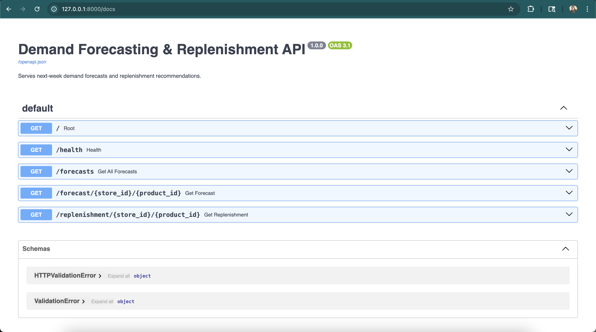
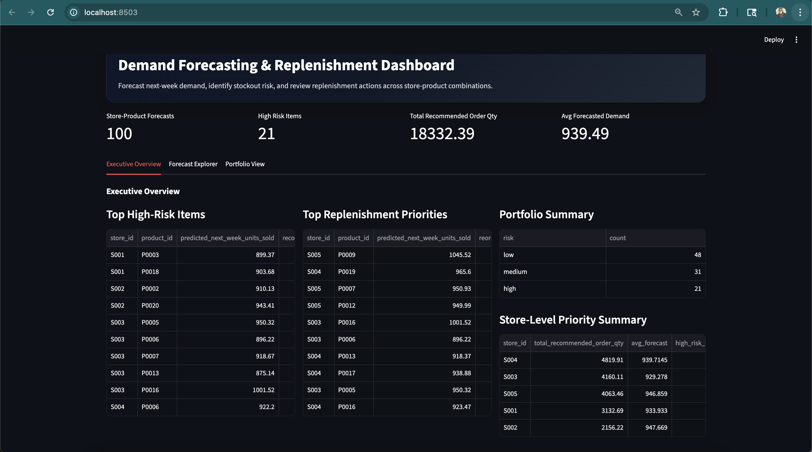

# Demand Forecasting & Replenishment Platform

An end-to-end retail analytics system that forecasts next-week demand at the store-product level, generates replenishment recommendations, serves results through a FastAPI backend, and provides a business-facing dashboard in Streamlit.

## Project Highlights

- Built an end-to-end demand forecasting and replenishment workflow from raw CSV ingestion to business-facing dashboard delivery
- Refactored the pipeline into a more production-style architecture with **raw / staging / curated** data layers
- Added reusable data validation checks for schema, duplicates, invalid dates, negative values, and mapping inconsistencies
- Logged validation and ingestion outputs for stronger traceability and pipeline reliability
- Benchmarked naive, rolling mean, Holt-Winters, and Random Forest models in a leakage-safe setup
- Exposed forecasts and replenishment recommendations through FastAPI endpoints
- Delivered an upgraded Streamlit dashboard with executive overview, forecast explorer, portfolio view, and recommendation insights
- Dockerized the application for reproducible local deployment

## Architecture Upgrade

The project now follows a more enterprise-ready analytics flow:

- **Raw layer** → source retail inventory CSV
- **Staging layer** → cleaned daily inventory data
- **Curated layer** → weekly modeling table, feature table, and scored forecasts
- **Validation layer** → reusable checks and validation reporting
- **Logging layer** → ingestion run log and validation outputs
- **Serving layer** → FastAPI backend + Streamlit business dashboard

This upgrade was done to make the project more aligned with how production analytics systems are structured, rather than remaining only a notebook-style modeling exercise.

## Validation and Logging

To make the pipeline more production-oriented, a validation layer was introduced before downstream aggregation and modeling.

The validation checks include:

- required column presence
- date parsing validity
- duplicate `(store_id, product_id, date)` records
- numeric coercion checks
- negative value checks
- unstable product-to-category mappings
- unstable store-to-region mappings

The pipeline now also writes operational artifacts for traceability:

- `logs/raw_validation_report.json`
- `logs/ingest_run_log.json`

## Screenshots

### FastAPI Docs


### Streamlit Dashboard


## 1. Business Problem

Retail planning teams need better visibility into future demand and replenishment requirements in order to reduce stockout risk and improve ordering decisions.

This project simulates a lightweight production-style forecasting product that:

- ingests raw retail inventory and sales data
- transforms it into a weekly modeling dataset
- builds next-week demand forecasts
- compares multiple forecasting approaches
- generates reorder recommendations and stockout risk signals
- exposes results through APIs and an interactive dashboard

## 2. Project Objective

The goal of this project is to demonstrate how a data and analytics solution can be built end to end, covering:

- data ingestion and transformation
- feature engineering
- forecasting model development
- benchmark comparison
- scoring and replenishment logic
- API-based serving
- user-facing dashboarding

This project is designed to showcase production-style analytics engineering rather than only notebook-based modeling.

## 3. Solution Overview

The platform follows this workflow:

1. Raw retail data is ingested from CSV
2. Daily observations are aggregated to weekly store-product level
3. Time-series features are created
4. A leakage-safe next-week forecasting setup is built
5. Multiple benchmark models are evaluated
6. Forecasts are scored for the most recent store-product combinations
7. Replenishment recommendations are calculated
8. Results are served via FastAPI and displayed in Streamlit

## 4. Dataset

Source file used:

- `retail_store_inventory.csv`

Key raw fields included:

- Date
- Store ID
- Product ID
- Inventory Level
- Units Sold
- Units Ordered
- Demand Forecast
- Price
- Discount
- Weather Condition
- Holiday/Promotion
- Competitor Pricing
- Seasonality

### Important data validation findings

During exploratory analysis, two source fields were found to be inconsistent:

- the same `Product ID` mapped to multiple `Category` values
- the same `Store ID` mapped to multiple `Region` values

Because these mappings were not stable, `Category` and `Region` were excluded from the first forecasting feature set to avoid injecting noise.

## 5. Modeling Design

### Forecasting grain

The final modeling grain was set to:

- **store_id + product_id + week**

Weekly aggregation was chosen because daily series were highly noisy and weekly aggregation gave a cleaner and more interpretable forecasting problem.

### Target definition

The final forecasting task was defined as:

- predict **next week’s units sold**

This was implemented by creating:

- `target_next_week`

for each store-product series.

### Leakage correction

An earlier modeling setup used same-week operational variables and produced unrealistically high performance. That setup was identified as leakage-prone.

The final forecasting setup was rebuilt to use only lagged and known-in-advance features, making the evaluation much more realistic.

## 6. Feature Engineering

The final model feature table included:

### Identifiers
- `store_id`
- `product_id`

### Time-series features
- `lag_1`
- `lag_2`
- `lag_4`
- `rolling_mean_4`
- `rolling_std_4`

### Calendar features
- `year`
- `month`
- `quarter`
- `week_of_year`

### Known-ahead / contextual features
- `holiday_promotion_flag`
- `dominant_seasonality`

### Excluded from final leakage-safe forecasting model
- `weekly_units_ordered`
- `avg_inventory_level`
- `avg_price`
- `avg_discount`
- `avg_competitor_pricing`
- `avg_demand_forecast`

These were excluded because they were potentially too close to the target week and could make the problem unrealistically easy.

## 7. Forecasting Models Evaluated

The following approaches were compared on a time-based train/test split:

### 1. Naive baseline
Predict next week using current week sales.

### 2. Rolling mean baseline
Predict next week using the recent 4-week average.

### 3. Holt-Winters
A classical univariate time-series benchmark fitted separately for each store-product series.

### 4. Random Forest
A feature-based machine learning model using lagged, calendar, and entity-level predictors.

## 8. Benchmark Results

Final results from the leakage-safe setup:

### Baseline: current week = next week
- MAE: 319.31
- RMSE: 400.22
- R²: -0.9917

### Baseline: rolling mean (4 weeks)
- MAE: 254.31
- RMSE: 320.46
- R²: -0.2769

### Holt-Winters
- MAE: 237.64
- RMSE: 301.63
- R²: -0.1313

### Random Forest
- MAE: 226.73
- RMSE: 284.67
- R²: -0.0076

### Interpretation

- Naive persistence performed poorly, indicating that next-week demand was not well approximated by simply repeating the most recent week.
- The rolling mean baseline improved substantially over naive persistence.
- Holt-Winters provided a strong classical time-series benchmark.
- Random Forest delivered the best MAE and RMSE among all tested methods, indicating that lag-derived and entity-level features added useful predictive signal beyond univariate trend extrapolation.

## 9. Replenishment Logic

After scoring the latest store-product rows, the project generates:

- `predicted_next_week_units_sold`
- `reorder_point`
- `recommended_order_qty`
- `stockout_risk`

### v1 replenishment assumptions

The replenishment layer is intentionally simple for the first version.

A reorder point is calculated using:

- forecasted next-week demand
- recent demand variability

Stockout risk is classified into:

- low
- medium
- high

This provides a practical decision-support layer for the dashboard and API.


## 10. Architecture

### High-level flow

```text
Raw CSV
→ Ingestion pipeline
→ Weekly modeling table
→ Feature engineering
→ Model training + benchmark comparison
→ Scored forecasts + replenishment output
→ FastAPI backend
→ Streamlit dashboard
```

## 11. Project Structure

```text
demand-forecasting-platform/
├── app/
│   └── main.py
├── assets/
│   ├── fastapi-docs.png
│   └── streamlit-dashboard.png
├── dashboard/
│   └── app.py
├── data/
│   ├── raw/
│   │   └── retail_store_inventory.csv
│   ├── staging/
│   │   └── clean_daily_inventory.csv
│   └── curated/
│       ├── weekly_modeling_table.csv
│       ├── model_feature_table.csv
│       └── scored_forecasts.csv
├── infra/
│   ├── Dockerfile.api
│   ├── Dockerfile.dashboard
│   └── docker-compose.yml
├── logs/
│   ├── raw_validation_report.json
│   └── ingest_run_log.json
├── models/
│   ├── random_forest_model.pkl
│   └── training_metrics.json
├── notebooks/
├── pipeline/
│   ├── ingest.py
│   ├── validate.py
│   ├── features.py
│   ├── train.py
│   └── score.py
├── .gitignore
├── README.md
└── requirements.txt
```

## 12. Pipeline Components

```text
pipeline/ingest.py
```
loads raw CSV
standardizes columns
validates types and required fields
aggregates daily data to weekly store-product level
removes incomplete edge weeks
writes weekly_modeling_table.csv

```text
pipeline/features.py
```
creates lag and rolling features
creates calendar features
creates target_next_week
removes rows without sufficient history
writes model_feature_table.csv

```text
pipeline/train.py
```
performs time-based train/test split
evaluates naive and rolling mean baselines
evaluates Holt-Winters benchmark
trains Random Forest model
saves model artifact and metrics

```text
pipeline/score.py
```
loads latest feature rows
applies trained model
generates next-week forecast
calculates reorder point and stockout risk
writes scored_forecasts.csv

## 13. API Layer


The FastAPI backend exposes scored forecasts and replenishment outputs.

```text
Endpoints
GET /
GET /health
GET /forecasts
GET /forecast/{store_id}/{product_id}
GET /replenishment/{store_id}/{product_id}
```

Example use cases
retrieve all scored forecasts
retrieve a single store-product forecast
retrieve replenishment recommendation for a selected item

## 14. Dashboard

The Streamlit dashboard now includes three business-facing views:

- **Executive Overview**: top high-risk items, replenishment priorities, and portfolio summary
- **Forecast Explorer**: store-product level forecast inspection with KPI cards, recent demand chart, and recommendation summary
- **Portfolio View**: filterable portfolio table with downloadable CSV output

## 15. How to Run Locally

1. Create and activate virtual environment
```text
python3 -m venv .venv
source .venv/bin/activate
```

2. Install dependencies
```text
python -m pip install -r requirements.txt
```

3. Run pipelines in order

```text
python pipeline/ingest.py
python pipeline/features.py
python pipeline/train.py
python pipeline/score.py
```

5. Start FastAPI
```text
uvicorn app.main:app --reload
```

6. Start Streamlit in a separate terminal
```text
streamlit run dashboard/app.py
```

7. Open in browser

FastAPI docs:
```text
http://127.0.0.1:8000/docs
```

Streamlit dashboard:
```text
http://localhost:8501
```

## 16. Key Learnings

This project highlighted several important real-world analytics engineering lessons:

- forecasting performance can be overstated if leakage-prone variables are not carefully removed
- weekly aggregation may be more practical than daily forecasting when series are highly noisy
- classical time-series models remain strong benchmarks and should not be ignored
- production-style analytics projects need more than modeling: they need pipelines, scoring logic, APIs, and a user-facing interface

## 17. Future Improvements

Potential next steps include:

- moving from CSV-based serving to Postgres or another database-backed storage layer
- deploying the FastAPI and Streamlit apps to a cloud environment using a no-cost or low-cost hosting setup
- adding scheduled retraining and automated scoring
- improving replenishment logic with lead-time and safety-stock assumptions
- enhancing dashboard visualization polish and business storytelling
- comparing additional forecasting models such as Gradient Boosting or SARIMAX
- adding monitoring, structured logging, and CI/CD workflows

## 18. Summary

This project demonstrates an end-to-end demand forecasting and replenishment workflow that goes beyond notebook-based analysis. It combines analytics engineering, forecasting, scoring, API serving, and dashboarding into a working prototype designed to reflect a real business-facing data product.
